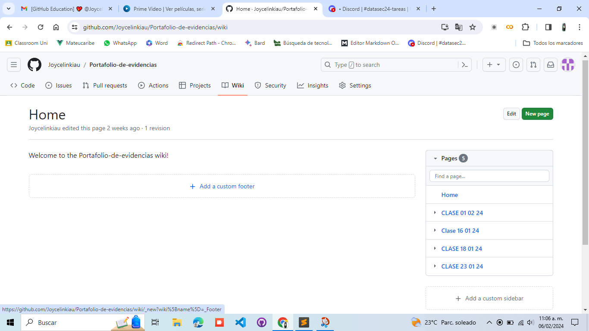
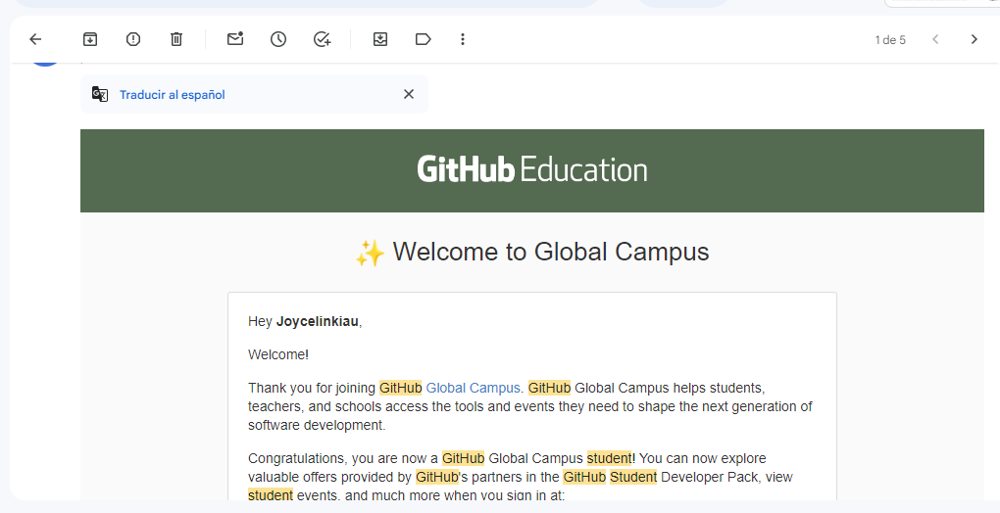
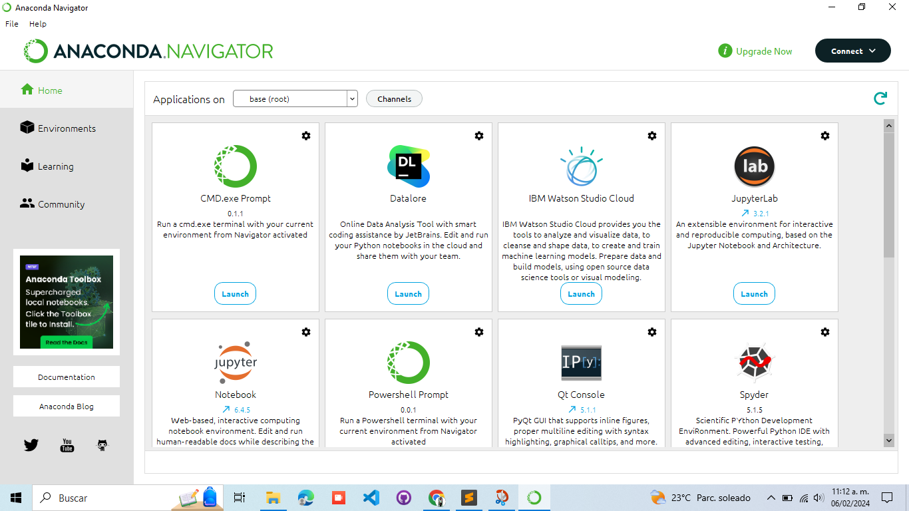
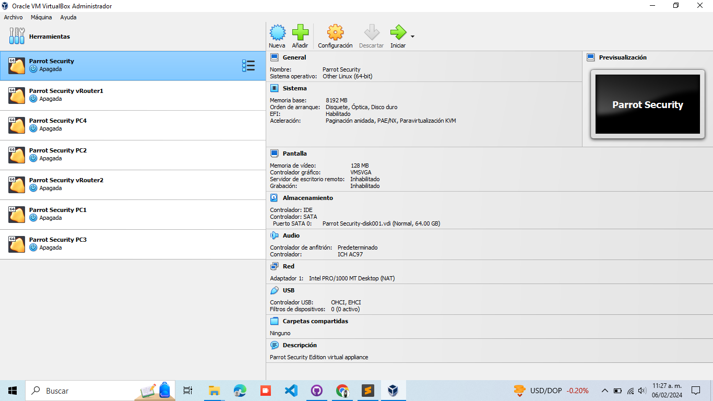
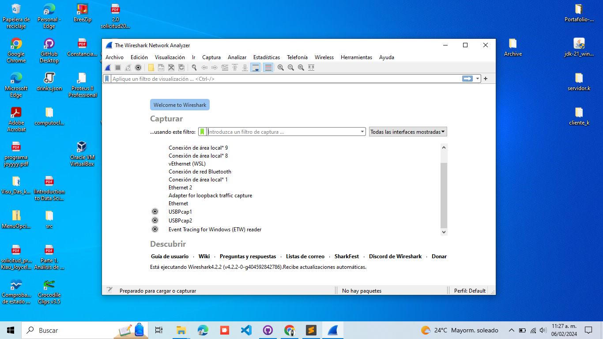
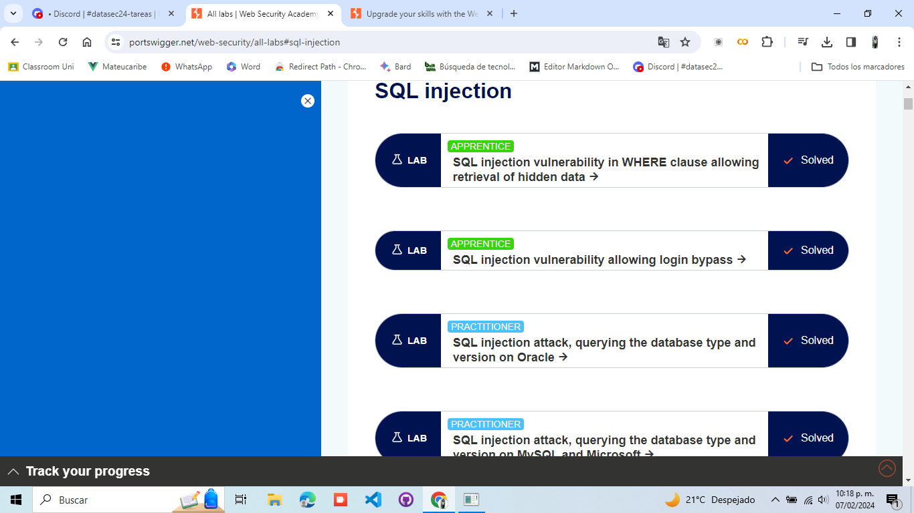
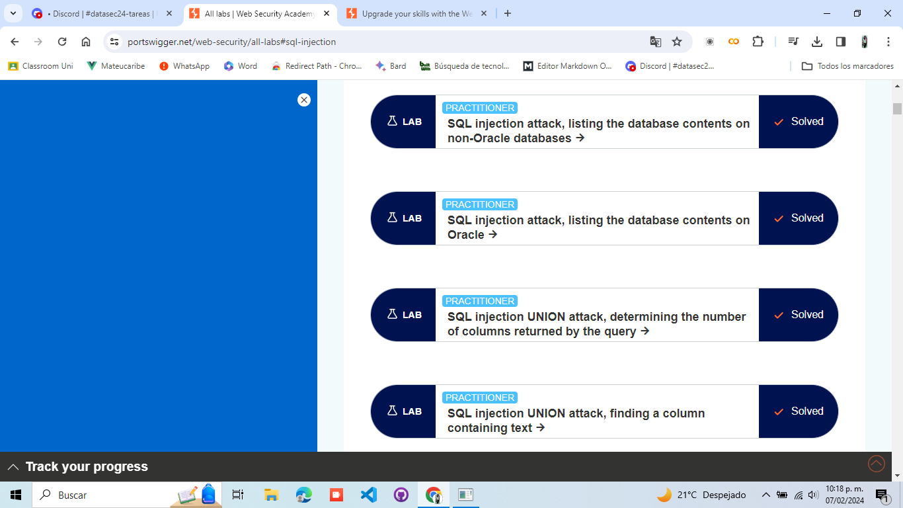
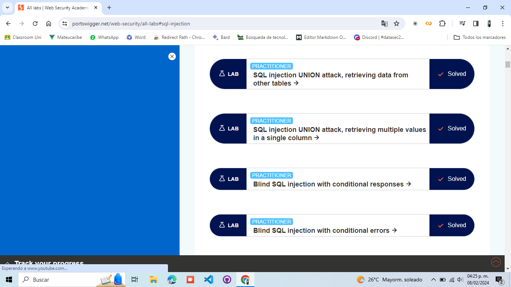
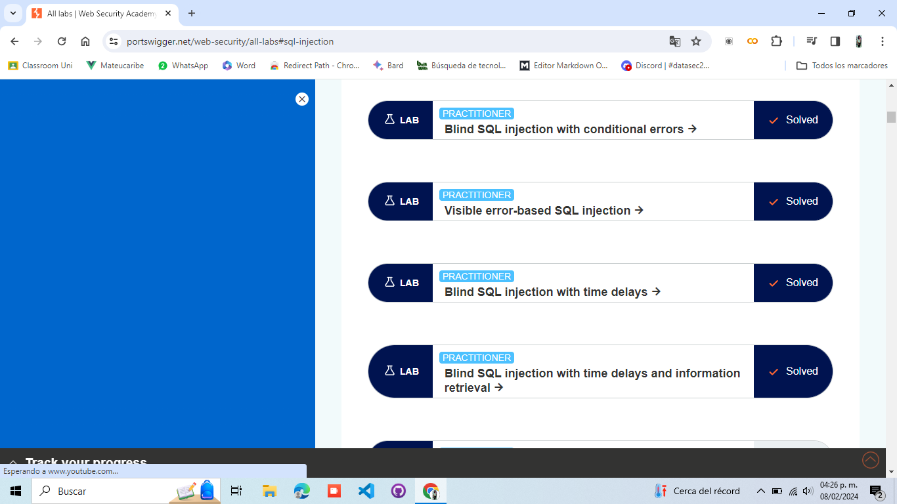

# Bitácora.

## Portada:

Nombre: Joycelin Monserrat Kiau Sandoval.

Materia: Seguridad de Datos.

### Apuntes de clase 16/01/24

Bienevenida a la clase, desmotracion de diversos aparatos que se utlizan el Seguridad de Datos en donde se realizan pruebas de concepto.

### Apuntes de clase 18/01/24

Se hizo un breve introducción a los conceptos de seguridad, en donde estuvimos viendo el triangulo de CIA y se hablo sobre sus 3 puntos: 
* confidencialidad:
* Integridad:
* Disponibilidad: 

Además, tambien se dijo que debe existir un equilibrio entre los aspectos del Usability Triangle.

### Tarea 999 

### Tarea 998 

### Tarea 997 

### Tarea 995: Conceptos basicos de seguridad.

| Concepto    | Definición  |
|:-------------:|:------------:|
| ""      | Confidencialidad: Garantiza que la información solo es accesible a aquellos autorizados para verla. 
| CIA Triad       |Integridad: Asegura que la información es precisa y no ha sido alterada de manera no autorizada. 
| ""     |Disponibilidad: Garantiza que la información y los recursos están disponibles cuando se necesitan.     | 
| Usability Triangle:      | Seguridad: Garantiza la protección de datos y sistemas contra accesos no autorizados.     | 
| ""    | Usabilidad: Asegura que los sistemas sean fáciles de usar y accesibles para los usuarios autorizados.      | 
| ""       | Funcionalidad: Se refiere a la capacidad del sistema para realizar sus funciones previstas.     | 
| Riesgo:       | En el contexto de la seguridad, es la probabilidad de que ocurra un evento adverso y cause un impacto negativo en ese evento.| 
| MFA (Autenticación Multifactorial):       | El MFA, o multifactor authentication, es una medida de seguridad que requiere que los usuarios proporcionen dos o más factores de autenticación para acceder a un sistema o recurso. Los factores pueden ser algo que el usuario sabe (contraseña), algo que el usuario tiene (token) y algo que el usuario es (biometría).      | 
| Vulnerabilidad:      | Es una debilidad en un sistema que puede ser explotada por una amenaza para comprometer la seguridad del sistema.     | 
| Amenaza:       | Una amenaza es una acción que puede causar un daño o perjuicio a un sistema. Las amenazas se pueden clasificar en función de su origen, como internas o externas.     | 
|Impacto:    | Es la consecuencia resultante de la explotación de una amenaza sobre un sistema. Puede incluir pérdida de datos, interrupción del servicio, daño a la reputación, entre otros.        | 

### Tarea 994 

### Apuntes clase 23/01/24

* hack Value: aquello que pueda ser interesante o valga la pena para que alguien lo quiera.
* Target of evaluation: objetivo de un atacante.
* ExploIT:forma definida para romper la seguridad de un IT
* Zero Day Attack: es el peor enemeigo de cualquier administrado de sistemas porque no se puede hacer nada.
* Vulnerability: existencia de una debilidad, diseño o implementación.
* Dalay Chaining: Los piratas informáticos que se salen con la suya con el robo de bases de datos generalmente completan su tarea y luego retroceden para cubrir sus huellas destruyendo registros. 

sistema detector de intrusos.

* Non repudiation: para que el usuario diga que no fue el.

### Vectores de ataque 

* insideer threats 
* Mobile device security
* organized 

### Tarea 988 Transcribir los primeros 5 scripts del libro Black Hat Python for Pentesters.

<strong>CODE 1</strong>

	def sum(number_one,number_two):

		number_one_int = convert_integer(number_one)
		number_two_int = convert_integer(number_two)

		result = number_one_int + number_two_int

		return result

	def convert_integer(number_string):

		converted_integer = int(number_string)
		return converted_integer

	answer = sum("1","2")

<strong>CODE 2 TCP CLIENT</strong>

	import socket

	target_host = "www.google.com"
	target_port = 80

	#create a socket object

	client = socket.socket(socket.AF_INET, socket.SOCK_STREAM)

	#connect the client
	client.connect((target_host,target_port))

	#Send some data
	client.send("GET / HTTP/1.1\r\nHost: google.com\r\n\r\n")

	#receive some data
	response = client.recv(4096)

	print response

<strong>CODE 3 UDP CLIENT</strong>

	import socket

	target_host = "127.0.0.1"
	target_port = 80

	#create a socket object
	u client = socket.socket(socket.AF_INET, socket.SOCK_DGRAM)

	#send some data
	client.sendto("AAABBBCCC",(target_host,target_port))

	#receive some data
	data, addr = client.recvfrom(4096)

	print data

<strong>CODE 4 TCP SERVER</strong>

	import socket
	import threading

	bind_ip = "0.0.0.0"
	bind_port = 9999

	server = socket.socket(socket.AF_INET, socket.SOCK_STREAM)

	server.bind((bind_ip,bind_port))

	server.listen(5)

	print "[ * ] Listening on %s:%d" % (bind_ip,bind_port)

	#this is our client-handling thread
	def handle_client(client_socket):

		# print out what the client sends
		request = client_socket.recv(1024)

		print "[ * ] Received: %s" % request

		# send back a packet
		client_socket.send("ACK!")

		client_socket.close()

	while True:
		
		client,addr = server.accept()
		
		print "[ * ] Accepted connection from: %s:%d" % (addr[0],addr[1])

		# spin up our client thread to handle incoming data
		client_handler = threading.Thread(target=handle_client,args=(client,))
		client_handler.start()

<strong>CODE 5 Replacing Netcat</strong>

	import sys
	import socket
	import getopt
	import threading
	import subprocess

	#define some global variables
	listen = False
	command = False
	upload = False
	execute = ""
	target = ""
	upload_destination = ""
	port = 0

	def usage():
		print "BHP Net Tool"
		print
		print "Usage: bhpnet.py -t target_host -p port"
		print "-l --listen - listen on [host]:[port] for ¬incoming connections"
		
		print "-e --execute=file_to_run - execute the given file upon ¬ receiving a connection"
		
		print "-c --command - initialize a command shell"
		print "-u --upload=destination - upon receiving connection upload a ¬ file and write to [destination]"
		
		print
		print
		print "Examples: "
		print "bhpnet.py -t 192.168.0.1 -p 5555 -l -c"
		print "bhpnet.py -t 192.168.0.1 -p 5555 -l -u=c:\\target.exe"
		print "bhpnet.py -t 192.168.0.1 -p 5555 -l -e=\"cat /etc/passwd\""
		print "echo 'ABCDEFGHI' | ./bhpnet.py -t 192.168.11.12 -p 135"
		sys.exit(0)

	def main():
		global listen
		global port
		global execute
		global command
		global upload_destination
		global target

		if not len(sys.argv[1:]):
			usage()

		# read the commandline options
		try:
			opts, args = getopt.getopt(sys.argv[1:],"hle:t:p:cu:", ¬ ["help","listen","execute","target","port","command","upload"])
		except getopt.GetoptError as err:
			print str(err)
			usage()

		for o,a in opts:
			if o in ("-h","--help"):
				usage()
			elif o in ("-l","--listen"):
				listen = True
			elif o in ("-e", "--execute"):
				execute = a
			elif o in ("-c", "--commandshell"):
				command = True
			elif o in ("-u", "--upload"):
				upload_destination = a

			elif o in ("-t", "--target"):
				target = a
			elif o in ("-p", "--port"):
				port = int(a)
			else:
				assert False,"Unhandled Option"

		# are we going to listen or just send data from stdin?
		if not listen and len(target) and port > 0:
		
			# read in the buffer from the commandline
			# this will block, so send CTRL-D if not sending input
			# to stdin
			buffer = sys.stdin.read()
			
			# send data off
			client_sender(buffer)
		
		# we are going to listen and potentially
		# upload things, execute commands, and drop a shell back
		# depending on our command line options above
		if listen:
			server_loop()

	main()	

### Apuntes clase 25/01/24
No se solicitaron apuntes 

### Apuntes clase 01/02/24
Se realizo una lluvia de ideas sobre los temas que hasta el momento habias visto sobre la materia, para después tener de encaragdo realizar 4 preguntas y respuestas.

°ebenwiber:

°time stack: hora exacta en la que sucede el evento.

°Elasticsearch (opensearch)- se usara para el proyecto. esta en modo cluster estructura que permite centratlizar los eventos que se generan en el sistema operativo,etc con q¿conetnga conexion de red, loes envia a una base de atos no relacional.

°Beat: agentes que instalan el dispsitvo final del cual quieres recolectar.

Elementos que se necesitan para asociar un evento a un usuario o dispositivo particular: -usuarios -tiempo -ip (puede no existir si es un elemento de windowns) -acción -recurso

correlacion con algo necesitas omologar los datos una vez centralizados.

°Logistash- normalizar los datos para poder pasarlos a elascticsearch°

°El objetivo de la estructura es para implementar un SIEM °Norma PCIDS - proteccion de datos TAREAAAA instalar docker desktop - windonws docker -linux opc2: podman

### Tarea 996 bitácora de apuntes usando markdown

### Tarea 997 continuación Git_Education

### Tarea 990 instalar: docker, python, virtualBox, vagrant, wireshark

# Tarea #985 Realizar los ejercicios de SQLInjection

### Apuntes clase 06/02/24
Temas vistos:
5 pilares de la seguridad.
CIAD TRIAN seguridad,
USABILITY TRIANGLE usabilidad,funcionalidad y seguridad
EXPLOIT
NOT-REPUDETION
MFA MULTIFACTOR AUTENTICATIONS:agrega una capa de protección al proceso de inicio de sesión.
HACK VALUE:
Fireboat, winlogdeat, metricbeat, padobeat
Tired of evaluation
Zero day
Metodo que usan atacanates: "escalamiento de privilegios" tratar de vulnerar un recurso, es decir. trata de gnar el acceso del administrador
Modelo OSI (7 capas):

Fisica Enlace Red Transporte sesion Presentación Aplicación

Esquemas de respalo a implementar: (en sistemas o paginas web)

full : respaldo completo de la base de datos diferencial: respalo que se hace de los cambios habidos desde que se saco el ultimo respaldo completo incrementa:solo respalda la infro que se agrega a la base de datos despues de hacer el respaldo diferencial, el tiempo se reduce tiene las utlimas queri

Traficos:

Unicas_ de una ip a otra Broadcast-trafico que se nevia a niverl de el¿nlace o a nivel de red, fisico-logico multicast- identifica el numero de dispositivos que estan corriendo en la red

Qué hace un Adminitrado de redes para evitar ataques

implementar dispositivos a nivel de red que no permitan a mas una direccion fisica en un puerto conocido como cazar la direccion fisica, cazar de asociar

hop- dispositivo con puertos que permite intercnoectar compus a nivel fisico switch - le permite leer la capaz a nivel de red. puedes implentar un protocolo 802 que le permite cazar una direccion fisica a un puerto para proteger una red

### Apuntes clase 15/02/24
Microsoft gestor de BD de SQLserver: permite crear usuarios de la base de datos, dandole permisos sobre que el acceso a la BD

Los servicios de bases de datos trae:

usuarios locales.
En ambientes grandes tienen varios servidores configurados con cluster que le permite mandara Query se le conoce como Alta disponibilidad, la info se sincroniza. Consume servicios que necesita autenticarse, si es con lo de la compañia requieres de un password.

Existe el servicio active directory: oermite administrar los recursos quw tienes desplegadoz en tu red en terminos de computadoras usuarios, organizarlos por grupos ademas de darles permisos y administrar credenciales, tambien administrar los del sistema operativo. Las compaias controlas las app que tienen descargadas puedes lihar la autenctifcacion de usuarios con los diferentes servicios de la compañia.

Puedes actualizar datos manualmente con el comando gpupdate

Protocolo LDAP - es una solucion que nos permite montar este mismo esquema en linux

Usuarios de aplicacion - una aplicacion para poder autenticar o hacer consultas, crea usuarios en dominio que solo la aplicaion va a usar.

DIferencia Usuarios personas y de aplicacion: La diferencia radica en la configuración.

Ataque de contraseñas basado en diccionario: compara las palabras del dicc.
Ataque de contraseñas basado en Fuerza bruta: prueba convinacion de caracteres.

Dumpsted diving: basura de otros

### Apuntes clase 20/02/24
Modelo OSI

Aplicación - @,url,uri Transporte - ports -> TCP UDP Red - Ip Enlace datos - MAC Fisica - Nic

16 bytes { src. port { desti. port

|puerto | indicador|
|:-------------:|:------------:|
|80 | HTML|
|22 | SSH|
|21 | FTD|
|23 | TELNET|
|25 | SMTD|
|53 | DNS|
|3306 | MySQL|
|8080 | TOMCAK|

Netstat -a -n -p TCP Lista de puertos escuchando localmente

nmap -> scaneo de puertos a toda red

nc

ncat -> scaneo de pueertos a una red

netcat

Ejemplo : nmap 192.168.1.0.0124 syntaxis para ncat: nc ip port

pruebas capaz transporte (443,80,25) a nivel capa red - convertir nombre

shodan.io -> servicio para scanear por cámaras

# Tarea investigar sobre puertos efímeros 
| Concepto    | Definición  |
|:-------------:|:------------:|
| Puertos Efímeros  |Van desde el 49152 hasta el 65535 y son unos puertos temporales de usar y tirar que el sistema operativo asigna a las aplicaciones cuando los necesitan. Una vez que la conexión ha terminado ese puerto queda libre y puede ser reutilizado nuevamente por cualquier otra aplicación.  | 

# PARCIAL 2 

# Tarea #984 Realizar los challenge de Bandit en overthewire.

Archivo en .txt

## Apuntes clase 27/02/24

AWS certificaciones -puedes iniciar con la que desees. -Descuento por uni 50 %

AWS
*Lamda - servicio que permite despleguear apps de manera sencilla *Dinamo DB - Big data *Arq. de la nube -

Informatica en la nube: -entrega bajo demanda a traves de internet con un sustena de pago por uso, en otras palabras es la computadora de alguien mas -permite ver la infraestructura como software y ya no como hardware

Pc- servidores privados virtuales rentados CIPANEL-

Modelo de infraestructura como hardware: -ciclo largo de adquisii¿cion

Modelo de infraestructura como software: -flexibles, cambiar de ofrma mas rapida, sencilla y rentable las soluciones de hardware -usuario de nube: hablan de ti

cliente: usuario final
Pago por uso: cobrar lo que usas, tiempo

Pizza as a service: muestra diferentes escenarios (LaaS,PaaS,SaaS:) image

LaaS:TODA RESPONSABILIDAD

PaaS:MEDIA RESPONSABILIDAD

SaaS: MENOS RESPONSABILIDAD

Modelo de implementacion de la nube -Nube -Híbrido
¿que son los servicios web? software a disposición atraves de internet y utiliza un formato estandarizado

AWS -platafroma en la nube segura que ofrece productos globales

VPC: Nube privada de amazon con ip asociadas para comunicar y crear infraestructuras clineten-servidor

Marco de adopción de la nube una region contiene mas zonas

## Apuntes clase 27/02/24

Curso 1 SECURITY IN THE AWS CLOUD

Bebeficios de la nube

pagas lo que usas -increemento de acts en ing¿fraestructura
Seguridad TRIAD todo nube debe llevar las 3 caracteristicas ()

5 caracteriscas de la seguridad de la nube *controlabilidad - admi de usuarios en control, visible en aws AMI *auditabilidad - quien tiene acceso, quien realizo una accion, cuando y donde se realizamo la accion visibe es AWS cloudtrall *visibilidad - visibke en awsConfi permite ver lo que tienes instalado en tu nube, el impacto, que es lo que tienes, que ha cambiado y la evidencia *agilidad y automatización - visible en AWSCloudFormation permite usar el concepto de infra en codigo a traves de plantillas,json; permite automatizar; permite asegurar la alta disponibilidad

CURSO 2 PRINCIPIOS DE DISEÑO DE LA SEGURIDAD enla nube

Menor privilegio: garantizar el acceso a usuario de sus tareas, hace cumplir la separación de deberes, obligar alusuario a camibar credenciales cada 90 dias
Activar trazabilidad: (trazabalidiad-capacidad de rastrear un evento)Monitoreo de acciones y cambios, usar metricas y auditar los recuros en la nube
Asegure todas las capas : no solo confiar en firewalls, usar mecanimos de seguridad que no le permitan llegar mas alla
automatizacion de seguridad: escribir crips, monitoreo de aletas: pasivas- avisa de problemas proativas- disparar una accion al detectar 5: proteger los datos ne transito y reposo: mejorar la cueri transito _ PVN todo viaja encriptado ; reposo_ no es el mismo timepo de respuesta cuando este encriptada o cuando no por el proceso de encriptado
Preparate para eventos de seguridad: tener un pan de respuestas a incidentes que invlucre todas las areas de la compañia, CON EL OBJETIVO DE REDUCIR el impacto 7- minimizar la superficie de ataque: segmentacion de los datos para fijar la seguridad en una parte de acuerdo a la norma
curso 3 MODELO DE RESPONSABILIDAD COMPARTIDA examen -Uno es responsable de la segu en la nube (en) -el provedor es responsable de la seguridad de la nube (de)

todo depénde del modelo de servicio la segu que tendra

¿DE quien es responsabilidad? Escenario 1

a)actualizar las intacias del SO AWS S2 (Infra como servicio) - cliente b)seguridad fisica del data center - provedor (nada a nivel fisico es del cliente) c)mantener tus datos para ti - provedor d)configuraciones de la maquina virtual Security groups - cliente e)configuraciones de privedores que corren en S2- CLIENTE f)Actualizaciones de Oracle y parches si la instancia corre en RDS - provedor *RDS- para bases de datos relacionales g)Actualizaciones de Oracle y parches si la instancia corre en SE - cliente h)S2 bucquet acceso de integridad- cliente *cliente puede resevrsr instacias fisicas en s2

ESCENARIO 2 a) aseurar que la consola de administrador de aws no sea hackeada? - provedor b) configurar la sub red - cliente a nivel logico es del clinete c) configurar la VPC - cliente d) proteger las regiones de aws contra caidas - provedor todo a nivel de red fisica es de amazon e) asefurar las laves de csh - cliente f) asegurar el aislamiento de la red - provedor g) asefurar las conexiones entre servidores y buquets tengan baja latencia - provedor h) enforzar el multifaltor autentication - cliente (amazon solo ofrece)

MANAGE SERVICES ORGANIZATION *RESPONSABILIDAD Y MOMENTO DE ESCENARIO Certificado - amazon llave -amazon